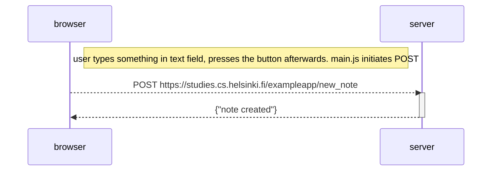

```mermaid
    sequenceDiagram
        participant browser
        participant server

        Note right of browser: user types something in text field, presses the button afterwards. main.js initiates POST

        browser-->>server: POST https://studies.cs.helsinki.fi/exampleapp/new_note
        activate server
        server-->>browser: {"note created"}
        deactivate server
```    